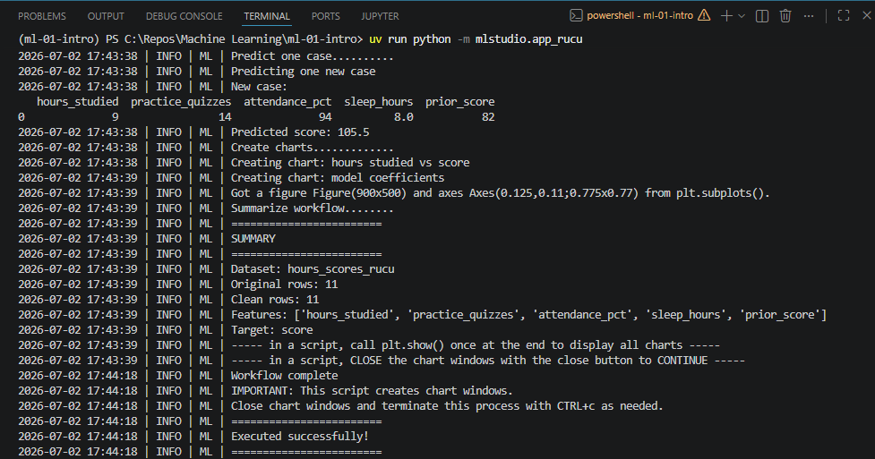

# Project Documentation

This site provides project documentation.
Use the documentation navigation to explore.

## How-To Guide

Many instructions are common to all our projects.

See
[⭐ **Workflow: Apply Example**](https://denisecase.github.io/pro-analytics-02/workflow-b-apply-example-project/)
to get the example projects running on your machine.

## Project Documentation Pages (docs/)

- **Home** - this documentation landing page
- [**Project Instructions**](./project-instructions.md)  - the standard project workflow
- [**Your Files**](./your-files.md) - how to copy the example and create your version
- [**Glossary**](./glossary.md) - project terms and concepts
- [**API**](./api.md) - autogenerated code documentation for the public project interface

---

## Phase 4. Technical Modification

Describe your small technical modification to the example project.

Include:

- What you changed- I customized the Python script and Jupyter Notebook. On the Jupyter notebook I changed the CANDIDATE_TARGET to a numeric column from a categorial one. On the Python script I tried adding a new column 'grade' and made a Predictive analysis based on the change.
- I also made changes to the dataset to run the python script.
- Why you chose that change- I wanted to understand how the Target field works in relation to the model .
- How you verified that it worked- I examined the results, once I changed the CANDITAE_TARGET field.The changes made to the Python script worket  and executed successfully.
- What result, output, chart, metric, or behavior confirmed the change- After the change was executed to a numeric field the model was changed from a classification to a Regression model.
- The changes made to the Python script displayed a different Predictive score from the example.

Compared with the example project,
explain what is different and why the change matters.
 The changes made to the Python script displayed a different Predictive score from the example.
Was it easy, or surprisingly challenging and why do you think so? It was Moderate.

## Phase 5. Custom Project (OPTIONAL in Module 1)

Describe your custom project.

In Module 1, this includes choosing a dataset, identifying a target,
and explaining what kind of ML problem it represents.

### Basis and Data

Describe the dataset, input, or example you started with.

Include:

- The original example dataset or input - The original example dataset is hours a student spends to get to the final score.
- The data source- I used the same dataset , added additional records to see the working of the model.
- Why you chose it, kept it, or changed it- Since the Custom Project was optional , I did'nt want to invest time in looking for a whole new dataset, rather I wanted to focus on the working of the linear regression model.
- Any important limitations or assumptions The limitation is that the dataset was small with limited features to explore , however great to understand details and easy to understand the changes.

### Modeling Approach

Describe the problem type and approach for this project.
The approach I chose to understand this model was given high inputs what will be the prediction of the analysis. It was not a practical score , however a correct linear regression result, given high inputs result in higher output.

Include:

- Is this supervised or unsupervised and how do you know
This is a supervised machine learning problem as the target feature  was known and there was no clustering on unpredicted analysis.
### Summary

Summarize your custom project.

Include:

- How you implemented your custom work- I created custom python script and Jupyter notebook.
- What results you got- I was able to get a Prediction for the data problem I had listed.
- What you learned- I learnt the importance of choosing the right feature to answer your data problem.
- How well you exercised the skills covered in this project- I think I was able to implement what was required for this module and get an understanding of how numeric fields or categorial fields affect the model. I also understood the working of a classified and Regression model.
- What kinds of real problems you could apply these skills to in the future- I can apply these skills to understand the factor affecting cost of living, factors affecting Patients health, Prediction for who might win in a future election based on previous scores, What can be a company's profit in the next 2 months .

Display at least one image or screenshot showing your work.

